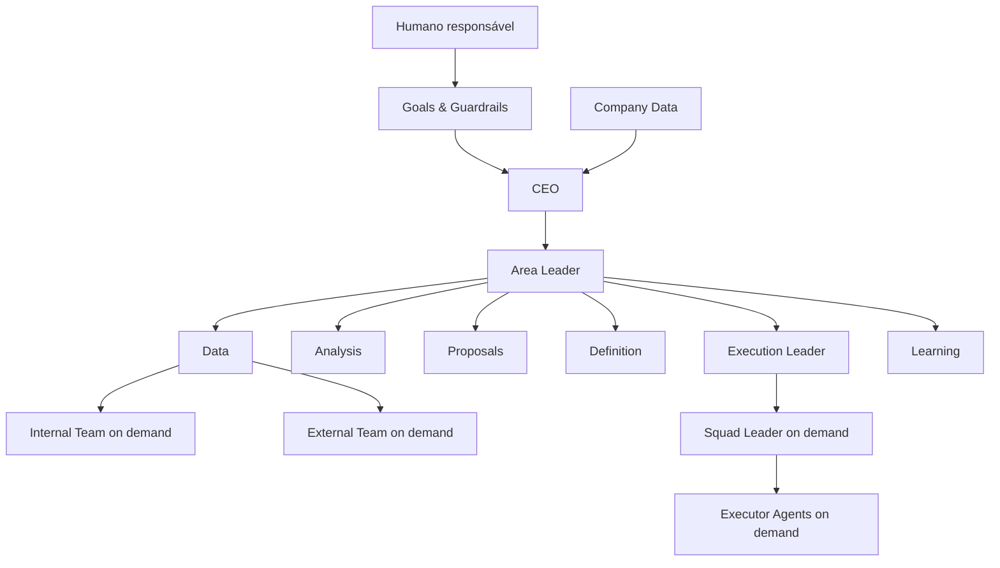
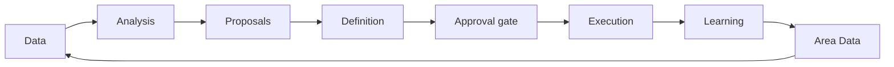

# Company Structure — Minimum Viable Autonomy

**Versão:** 2.1  
**Finalidade:** definir a estrutura organizacional mínima que permite orientação a objetivos, operação agêntica e autoaprendizado progressivo.

## 1. Minimum Viable Autonomy

Minimum Viable Autonomy (MVA) é a composição mínima necessária para que exista um grau inicial de autonomia dos agentes na Company.

O MVA possui quatro requisitos:

1. **Orientação a objetivos**  
   Goals & Guardrails são registrados na Company, ficam acessíveis aos agentes e orientam decisões e tasks.

2. **Base de conhecimento e agentes unificados**  
   Documentos, dados, agentes, skills e suas versões possuem fontes conhecidas, acessíveis e organizadas.

3. **Times de inteligência e execução**  
   A Company separa a produção de entendimento e decisões da execução das ações aprovadas.

4. **Loops de aprendizado**  
   A execução é analisada continuamente; resultados geram aprendizados registrados e incorporados aos ciclos seguintes mediante governança.

O MVA não pretende representar a estrutura final. O usuário pode melhorar a Company gradualmente com novas Áreas, agentes especializados, skills, automações, integrações, budgets e políticas.

## 2. Fronteira do MVA

São obrigatórios no boot:

- Goals & Guardrails;
- CEO;
- Company Data;
- pelo menos uma Área ligada ao Main Goal;
- Area Leader;
- Area Data;
- responsabilidades persistentes de Data, Analysis, Proposals, Definition, Execution Leader e Learning;
- capacidade de criar Internal/External Teams, squads e executores sob demanda;
- humano no circuito;
- budgets, permissões, approvals e heartbeats mínimos;
- rastreabilidade do Area Loop.

Não são obrigatórios no boot:

- múltiplas Áreas sem necessidade comprovada;
- coletores especializados persistentes;
- squads ociosos;
- automação integral de todos os processos;
- custom plugins;
- modelos locais;
- reorganização automática;
- aprendizado que modifica estrutura sem aprovação;
- integrações além das necessárias para o primeiro ciclo.

## 3. Visão estrutural



Este diagrama representa reporting lines. O fluxo de trabalho é descrito separadamente no Area Loop.

## 4. Camadas de estado

### 4.1 Repo fonte

O repo contém o padrão reutilizável:

- Company Start;
- Company Structure;
- Agents Creation Instructions;
- Standard Guardrails;
- Business Method;
- referências opcionais de infraestrutura, plugins e skills.

O repo é fonte de padrão, não memória operacional da Company.

### 4.2 Company Data

Company Data existe somente dentro da Company instanciada. Deve conter ou referenciar:

- Company Description;
- Goals & Guardrails;
- cópia ativa de Standard Guardrails;
- CEO Additional Instructions;
- Company Config;
- Skill Registry;
- Source Manifest com repo, branch, commit e versão;
- Company Decision Log;
- Company Learning Log;
- registros de budgets, approvals e mudanças estruturais;
- referências às Áreas e seus estados.

Company Data é acessível conforme permissões. A existência de acesso de leitura não concede direito de alteração.

### 4.3 Area Data

Cada Área possui Area Data isolado logicamente, contendo:

#### Area Settings

- descrição;
- purpose;
- scope e out of scope;
- goals e success metrics;
- guardrails;
- decision rights;
- budget;
- configurações;
- data sources;
- ferramentas e skills;
- versão.

#### Area Database

- dados internos e externos;
- Evidence Records;
- Data Packages;
- Analytical Briefs;
- Proposal Sets;
- Definition e Decision Records;
- Execution Plans;
- Execution Results;
- métricas;
- hipóteses e seu grau de confiança;
- incidentes e bloqueios.

#### Learning Log

- Learning Records;
- mudanças sugeridas;
- aprendizados aprovados;
- limites de validade;
- versões afetadas.

#### Files

- arquivos de suporte;
- contratos;
- imagens;
- datasets;
- documentos;
- anexos e fontes autorizadas.

O Area Leader lê e atualiza Area Settings, decisões e prioridades. Data coordena o acesso e a organização dos dados. Learning registra aprendizados. Os demais agentes registram seus artefatos no Area Database.

## 5. Goals & Guardrails

### 5.1 Responsabilidade humana

O humano responsável define ou aprova:

- Main Goal;
- limites de atuação;
- riscos aceitáveis;
- decisões reservadas;
- budget inicial;
- mudanças estratégicas e estruturais materiais.

### 5.2 Responsabilidade do CEO

O CEO pode criar subgoals quando necessário, desde que:

- sejam rastreáveis ao Main Goal;
- respeitem guardrails;
- possuam métricas ou critérios de conclusão;
- não ampliem silenciosamente a autoridade da Company;
- sejam registrados em Company Data.

### 5.3 Responsabilidade da Área

Cada Área recebe Goals próprios ligados à Goal Tree. Nenhuma task pode existir sem relação identificável com um Goal ou com manutenção necessária da estrutura autorizada.

## 6. CEO

O CEO é responsável por conduzir a Company em direção aos Goals dentro dos Guardrails.

Responsabilidades mínimas:

- manter Goals, Company Data e estrutura coerentes;
- consultar Business Method para identificar quais capacidades de negócio devem virar Areas agora e quais devem permanecer futuras;
- criar Area Leaders;
- criar ou autorizar agentes conforme Agents Creation Instructions;
- conectar skills e ferramentas autorizadas;
- distribuir budget e prioridades;
- resolver conflitos cross-area;
- escalar decisões reservadas ao humano;
- revisar aprendizados com impacto corporativo;
- manter a Company no MVA ou em nível superior aprovado.

O CEO não executa rotineiramente o trabalho das Áreas e não microgerencia tasks de squads.

## 7. Área

Uma Área é uma célula operacional autoevolutiva. Sua estrutura é a mesma para scopes amplos ou específicos.

Cada Área possui:

- Area Settings;
- Area Leader;
- Area Data;
- time de inteligência;
- time de execução;
- Learning Agent;
- humano no circuito por meio dos approvals aplicáveis.

### 7.1 Area Leader

O Area Leader é dono do resultado da Área. Ele:

- mantém Scope & Goals;
- define prioridades e perguntas;
- orquestra o Area Loop;
- coordena inteligência, definição, execução e aprendizado;
- aprova decisões dentro de seus decision rights;
- escala o restante ao CEO ou humano;
- acompanha métricas, budget, riscos e dependências;
- propõe evolução da Área.

Não existe Intelligence Leader obrigatório no MVA. Uma Área pode criar coordenação adicional posteriormente quando volume ou complexidade justificarem.

### 7.2 Formação e fronteira de uma Area

Uma Area é uma unidade de responsabilidade com:

- purpose e Scope próprios;
- Goals ligados ao Main Goal;
- success metrics;
- owner identificado;
- dados, arquivos e artefatos próprios;
- decision rights e guardrails;
- budget ou política de consumo;
- capacidade de inteligência, execução e aprendizado.

Uma Area pode representar:

- uma função ampla, como Marketing ou Jurídico;
- uma unidade de negócio, produto, mercado ou localização;
- um processo recorrente;
- um resultado específico;
- uma capacidade temporária necessária a um Goal.

O nome da Area é apenas um rótulo. Seu contrato real é o `Area Settings`, especialmente Purpose, Scope, Out of Scope, Goals, Metrics e Decision Rights.

Não crie uma Area apenas porque ela existe em organogramas tradicionais ou aparece como template no Business Method. A separação precisa demonstrar ao menos um dos seguintes motivos:

- objetivo próprio e mensurável;
- conhecimento, dados, skills ou guardrails específicos;
- trabalho recorrente suficiente;
- decision rights distintos;
- risco que justifica segregação;
- budget ou responsável próprio;
- ganho claro de foco, qualidade ou autonomia.

Quando dois escopos possuem pouco volume, objetivos muito próximos e utilizam os mesmos dados, devem começar consolidados.

### 7.3 Granularidade

Considere dois eixos:

- **Scope:** amplo ou específico;
- **Goals:** abrangentes ou delimitados.

Use uma Area ampla quando:

- o volume inicial é baixo;
- os processos ainda são desconhecidos;
- a Company está aprendendo;
- a separação criaria agentes ociosos;
- os objetivos ainda são fortemente dependentes.

Use uma Area específica quando:

- existe alta frequência de trabalho;
- o resultado pode ser medido isoladamente;
- há dados, skills, budget ou guardrails próprios;
- o escopo amplo gera conflito, gargalo ou baixa qualidade;
- autonomia local reduz coordenação desnecessária.

Exemplo de evolução possível:

```text
Marketing
└── Redes Sociais
    └── Instagram
        ├── Carrossel
        ├── Imagens
        └── Vídeos
            ├── Vídeos de depoimentos
            └── Vídeos de notícias
```

A Company não cria toda a árvore antecipadamente. Ela começa no nível mínimo útil e especializa somente mediante evidência.

### 7.4 Ciclo de vida estrutural

#### Criar

Crie uma Area quando uma capacidade necessária a um Goal não estiver adequadamente coberta e os critérios da seção 7.2 forem satisfeitos. O `BUSINESS_METHOD.md` pode fornecer o template e o momento; esta seção determina se a separação estrutural é válida.

#### Dividir

Considere dividir quando:

- Scope & Goals deixarem de caber em um contrato claro;
- o Area Leader se tornar gargalo recorrente;
- existirem fluxos com dados, skills ou guardrails muito diferentes;
- conflitos de prioridade se repetirem;
- uma subcapacidade possuir volume e métricas próprios;
- o aprendizado indicar ganho provável de autonomia.

#### Combinar

Considere combinar quando:

- houver duplicação de agentes, dados ou decisões;
- Goals se tornarem inseparáveis;
- o volume não justificar estruturas distintas;
- handoffs criarem mais custo do que valor;
- as Areas utilizarem as mesmas skills, stakeholders e decision rights.

#### Pausar ou encerrar

Considere pausa ou encerramento quando:

- o Goal for concluído ou removido;
- não houver mais trabalho recorrente;
- a Area deixar de contribuir ao Main Goal;
- o custo superar o valor;
- suas responsabilidades forem absorvidas por outra Area.

Dados, decisões e aprendizados devem ser preservados conforme política de retenção. Pausa ou encerramento não autoriza exclusão silenciosa de histórico.

### 7.5 Mudança estrutural

CEO, Area Leader ou Learning podem propor criação, divisão, combinação, pausa ou encerramento. A proposta deve conter:

- evidências observadas;
- problema da estrutura atual;
- relação com Goals;
- mudança pretendida e resultado esperado;
- custos, agentes, budgets e dependências afetados;
- alternativa de não mudar;
- riscos e impacto nos guardrails;
- plano de migração e rollback;
- aprovação necessária.

Learning registra e propõe; não aplica mudança estrutural autonomamente. Mudanças materiais seguem `STANDARD_GUARDRAILS.md` e são registradas no Company Decision Log.

### 7.6 Fronteira com Business Method

`BUSINESS_METHOD.md` é a biblioteca de Areas de negócio e de seus momentos de ativação. Ele ajuda o CEO a identificar **o que pode ser criado e quando**.

`COMPANY_STRUCTURE.md` define **como qualquer Area é formada, opera, evolui e se relaciona com a Company**.

## 8. Time de inteligência

O time de inteligência transforma contexto e dados em uma decisão rastreável.

### 8.1 Data

- identifica necessidades de informação;
- acessa e organiza Area Data;
- coordena Internal e External Teams;
- normaliza, deduplica e versiona dados;
- registra fontes, qualidade, atualidade e limitações;
- produz Data Package.

### 8.2 Internal Team

Unidade on-demand de coleta em fontes internas autorizadas, como documentos, bancos, sistemas, logs, comunicações e operações.

### 8.3 External Team

Unidade on-demand de coleta em fontes externas autorizadas, como web, APIs, pesquisas, benchmarks, legislação e mercado.

### 8.4 Analysis

- estrutura premissas;
- avalia evidências;
- identifica padrões, causas prováveis, riscos e oportunidades;
- diferencia fatos, inferências e hipóteses;
- produz Analytical Brief.

### 8.5 Proposals

- transforma análise em alternativas;
- inclui cenário de não ação quando aplicável;
- propõe experimentos e ações;
- estima impacto, esforço, custo, prazo, risco e reversibilidade;
- produz Proposal Set.

### 8.6 Definition

- verifica propostas e critérios;
- transforma a alternativa selecionada em definição formal;
- identifica aprovação necessária;
- especifica Goals, Guardrails, subgoals, métricas, stop conditions e rollback;
- produz Decision Record ou pedido de aprovação.

Definition não inicia execução sem a autoridade ou aprovação exigida.

## 9. Time de execução

### 9.1 Execution Leader

- recebe Decision Record aprovado;
- cria Execution Plan;
- define tasks, squads, dependências e checkpoints;
- aloca budget, ferramentas e acessos autorizados;
- acompanha execução e resultados;
- consolida Execution Result;
- envia resultados ao Learning Agent.

### 9.2 Squad Leader

Agente on-demand que coordena um conjunto delimitado de tasks e Executor Agents.

### 9.3 Executor Agent

Agente on-demand que executa uma task autorizada, verificável e ligada ao Execution Plan.

Squads e executores são encerrados ou pausados quando sua finalidade termina, preservando logs e artefatos.

## 10. Learning

Learning é independente do time de execução e reporta ao Area Leader.

Ele:

- recebe Decision Record, Execution Plan e Execution Results;
- compara previsto versus realizado;
- avalia métricas e evidências;
- identifica o que funcionou, falhou e em quais condições;
- atualiza confiança de hipóteses;
- registra Learning Record;
- sugere mudanças de coleta, análise, propostas, definição e execução;
- escala aprendizados cross-area ao CEO.

Learning registra e propõe. Mudanças materiais seguem guardrails e approvals.

## 11. Area Loop



### 11.1 Etapas e artefatos

| Etapa | Função | Artefato mínimo |
|---|---|---|
| Data | captar e estruturar dados internos e externos | Data Package |
| Analysis | estruturar premissas e avaliar evidências | Analytical Brief |
| Proposals | gerar alternativas e experimentos | Proposal Set |
| Definition | formalizar escolha, Goals, Guardrails e subgoals | Decision Record |
| Execution | criar tasks e squads e executar | Execution Plan e Execution Result |
| Learning | estruturar aprendizados | Learning Record |

### 11.2 Approval gate

- Area Leader aprova decisões dentro de seus decision rights.
- CEO aprova decisões cross-area ou acima da autoridade da Área.
- Humano aprova decisões reservadas por Goals & Guardrails.

### 11.3 Retornos obrigatórios

- Internal/External Teams devolvem Evidence Records a Data.
- Executor Agents devolvem resultados ao Squad Leader.
- Squad Leader devolve Squad Result ao Execution Leader.
- Execution Leader devolve resultado consolidado ao Learning.
- Learning escreve em Area Data.
- O ciclo seguinte utiliza Area Data atualizado.

## 12. Instruções e skills dos agentes

As instruções runtime devem ser enxutas. Elas não copiam integralmente todos os documentos.

Cada agente recebe:

- identidade e papel;
- reports-to;
- Company e Area aplicáveis;
- Goals e Scope;
- referências versionadas aos documentos normativos;
- local de Company Data e Area Data;
- inputs e outputs;
- decision rights;
- tools, skills e permissões;
- budget e heartbeat;
- stop conditions e approvals.

O padrão de geração está em `AGENTS_CREATION_INSTRUCTIONS.md`.

## 13. Persistência dos agentes no MVA

### Persistentes

- CEO;
- Area Leader;
- Data;
- Analysis;
- Proposals;
- Definition;
- Execution Leader;
- Learning.

### On-demand

- Internal Team agents;
- External Team agents;
- Squad Leaders;
- Executor Agents;
- especialistas adicionais.

A Company pode consolidar papéis no mesmo runtime somente quando explicitamente aprovado e quando preservar artefatos, limites e segregação necessária.

## 14. Mapeamento mínimo para Paperclip

| Estrutura | Paperclip |
|---|---|
| Company | Company |
| Main Goal | Goal raiz |
| Subgoal | Goal descendente |
| Área | Project e Goal da Área |
| Area Settings | Documento do Project/Area Data |
| Agente | Agent no org chart |
| Reporting line | `reports_to` |
| Ciclo de inteligência | Issue com sub-issues e work products |
| Decisão | Decision Record e approval aplicável |
| Execução | Issue/sub-issues atribuídas a squad e executores |
| Aprendizado | Learning Record e task de melhoria |
| Company/Area Data | Documents, workspace e work products com acesso controlado |
| Rotina | Routine/heartbeat quando necessário |
| Budget | Política de budget da Company, agentes, goals ou projects |

O mapeamento deve usar os recursos disponíveis na versão instalada do Paperclip. O CEO não inventa entidades inexistentes; registra adaptações no Implementation Plan.

## 15. Estados

### Company

- `BOOTSTRAPPING`
- `OPERATIONAL`
- `DEGRADED`
- `PAUSED`
- `ARCHIVED`

### Área

- `DRAFT`
- `READY`
- `ACTIVE`
- `BLOCKED`
- `PAUSED`
- `LEARNING_PENDING`
- `ARCHIVED`

### Trabalho

- `DRAFT`
- `READY`
- `IN_PROGRESS`
- `WAITING_DEPENDENCY`
- `APPROVAL_REQUIRED`
- `BLOCKED`
- `COMPLETED`
- `PARTIAL`
- `FAILED`
- `CANCELLED`

## 16. Critérios de MVA implementado

A Company alcança MVA quando:

- Goals & Guardrails estão registrados e acessíveis;
- CEO e humano responsável estão identificados;
- Company Data existe e contém Source Manifest;
- existe pelo menos uma Área necessária ao Main Goal;
- cada Área possui Area Settings e Area Data;
- responsabilidades persistentes do Area Loop estão atribuídas;
- inteligência e execução estão separadas;
- reporting lines e decision rights estão definidos;
- existe approval gate antes de execução material;
- o resultado da execução chega a Learning;
- Learning registra no Area Data;
- budgets, permissões e heartbeats estão definidos;
- uma task pode ser rastreada até um Goal;
- o Company Start Report não contém conflito crítico aberto.

## 17. Evolução posterior

Depois do MVA, a Company pode melhorar mediante evidência:

- criar agentes coletores persistentes;
- dividir ou combinar Áreas;
- especializar Analysis, Proposals ou Execution;
- instalar plugins;
- adicionar integrações e automações;
- elevar frequência de heartbeats;
- ampliar autonomia dentro de guardrails;
- criar novos loops e métricas;
- importar aprendizados cross-area.

Toda evolução segue o ciclo de aprendizado e as aprovações aplicáveis.
